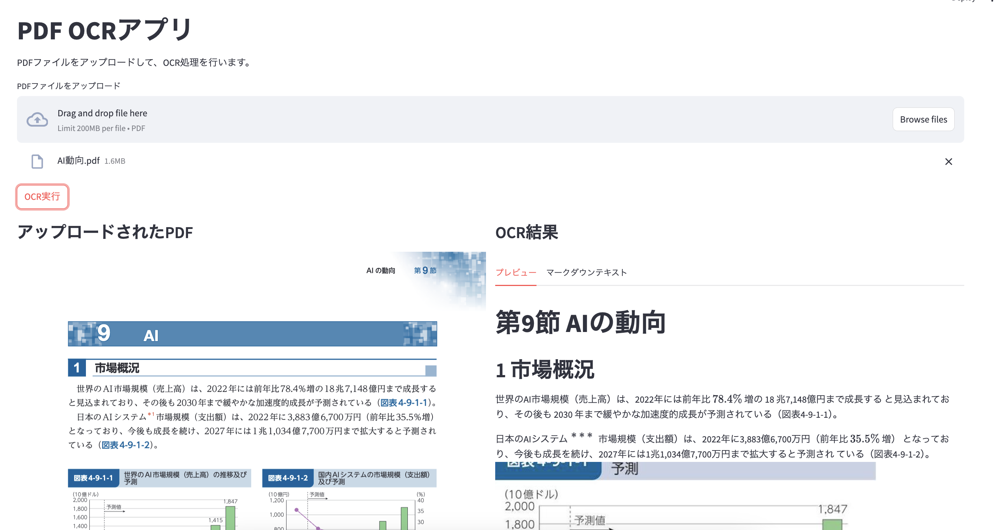

# PDF OCRアプリケーション

PDFファイルをアップロードし、OCR処理を行い、テキストと画像を含むMarkdown形式で結果を表示するStreamlitアプリケーション。



## 機能

- PDFファイルのアップロード
- MistralのOCR APIを使用したOCR処理
- OCR結果（Markdown形式）の表示
- PDFとOCR結果を横並びに表示
- OCR結果は白背景で黒文字で表示
- 画像が切れないように最適化
- タブを使用してプレビューとマークダウンテキストを切り替え可能

## 必要条件

- Python 3.8以上
- Mistral APIキー（[Mistral Console](https://console.mistral.ai/)で取得可能）

## インストール

1. リポジトリをクローン

```bash
git clone https://github.com/yourusername/mistral-ocr-app.git
cd mistral-ocr-app
```

2. 仮想環境の作成と依存パッケージのインストール

```bash
python -m venv venv
source venv/bin/activate  # Windowsの場合: venv\Scripts\activate
pip install -r requirements.txt
```

3. 環境変数の設定

`.env.example`ファイルを`.env`にコピーし、Mistral APIキーを設定します。

```bash
cp .env.example .env
```

`.env`ファイルを編集し、`MISTRAL_API_KEY`にあなたのAPIキーを設定します。

## 使用方法

1. アプリケーションの起動

```bash
source venv/bin/activate  # 仮想環境をアクティベート
streamlit run src/main.py
```

2. ブラウザで`http://localhost:8501`にアクセス

3. PDFファイルをアップロードし、「OCR実行」ボタンをクリック

4. OCR処理が完了すると、以下のように表示されます：
   - 左側にPDFが表示されます
   - 右側にOCR結果が白背景・黒文字で表示されます
   - タブを切り替えて、プレビューまたはマークダウンテキストを表示できます
   - OCR結果には画像も適切に表示されます

## 実装の詳細

- Streamlitを使用したWebインターフェース
- MistralのOCR APIを使用してPDF文書を処理
- PDFの表示には`<embed>`タグを使用
- OCR結果の表示にはCSSでスタイリングされたHTML要素を使用
- タブを使用してプレビューとマークダウンテキストを切り替え

## 注意事項

- OCR処理には時間がかかる場合があります
- 大きなPDFファイルの場合、処理に時間がかかる場合があります
- APIキーは`.env`ファイルに保存し、公開リポジトリにコミットしないでください
